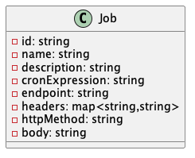
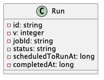
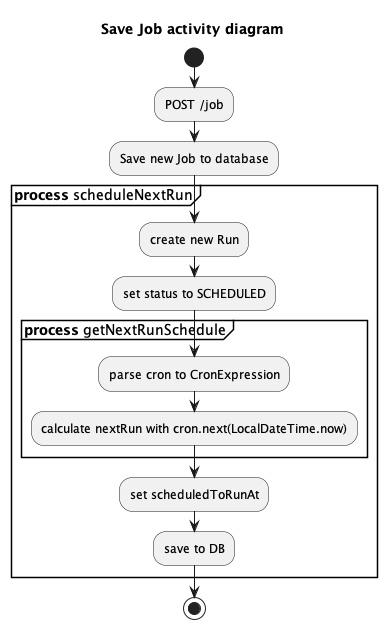
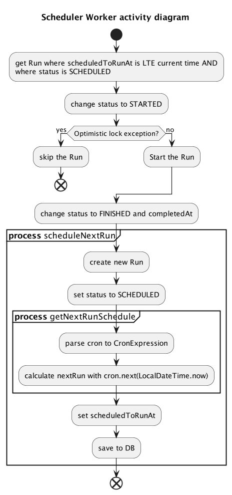

# Mini Project PFBE Scheduler POC

The PFBE scheduler provides a high level of flexibility for job scheduling, including the following key features:
- Monitoring of all executed jobs
- Monitoring of upcoming jobs scheduled for the next run
- Tracking of detailed information for each job run, such as start and finish times, more
- Ability to schedule jobs in a multi-pods environment

## Class Diagram
The scheduler have only 2 classes. Class `Job` describes the job itself, and `Run`
to describe a run. A Job will have multiple `Run` objects saved in the database.

- Class Job

- Class Run

## How It Works
On its core, the app works by scanning all runs every minute in the database. Only eligible run 
objects will be queried and started by `SchedulerWorker`, that is when `Run.scheduledToRunAt` is less 
than current time AND `Run.status` is `SCHEDULED`. This way, it's possible to tackle a multi-pod 
environment problem where it's almost always guaranteed a pod only executes a run once. 

- Save Job Flow

When a new job is added, it will immediately schedule for the next run.

- Scheduler Worker Flow

The retrieval and processing of the `Run` objects is done reactively using flux.

